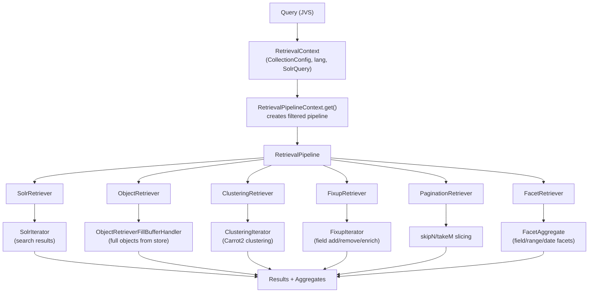

# hitorro-objretrieval

Solr-based object retrieval and search framework with retrieval pipelines, object storage, and document clustering.

## Overview

The hitorro-objretrieval module provides a high-level abstraction for complex search operations built on Apache Solr 9.4.1. It combines full-text search with persistent object storage (JetBrains Xodus), document clustering (Carrot2), and a modular retrieval pipeline architecture.

### Key Capabilities

- **Retrieval Pipelines** - Chain retriever modules (search, object fetch, clustering, fixup, pagination, facets) into configurable processing pipelines
- **Solr Integration** - Full Apache Solr 9.4.1 support with query visitors for extensible query processing
- **Object Store** - Xodus-based persistent key-value storage with sharding, compression, and batch operations
- **Document Clustering** - Carrot2 integration with Lingo and Bisecting K-Means algorithms
- **External Feature Fields** - Custom Solr field types for feature-based ranking and scoring
- **Collection Management** - Multi-collection support with intent-based query modulation
- **Field Mapping** - Language-aware, type-aware field translation between JVS types and Solr fields

## Architecture



### Package Structure

```
com.hitorro.obj.core/
├── solr/
│   ├── RetrievalContext          # Execution environment (query, collection, language)
│   ├── RetrievalContextBase      # Field mapping, type resolution, alias management
│   ├── SolrService               # Central Solr management (add/remove cores, search, enrich)
│   ├── SolrDocumentSink          # HTTP-based batch document indexing
│   ├── SolrIterator              # Wraps Solr DocumentList as JVS iterator
│   ├── SolrInfo                  # Core status caching
│   ├── SolrJSONUtils             # SimpleOrderedMap to JsonNode conversion
│   ├── SolrQueryContext          # Thread-local query context
│   ├── TypeFieldMapper           # Maps between decorated and original field paths
│   ├── collection/
│   │   ├── CollectionConfig      # Multi-collection configuration with intent maps
│   │   └── CollectionIntent      # Per-collection query modulators
│   ├── queryvisitors/
│   │   ├── QueryVisitor          # Visitor interface (Query, Debug, Facets, Filter, Group, Select, Sort, Rows)
│   │   ├── DateFacets            # Date range faceting
│   │   └── RangeFacets           # Numeric range faceting
│   └── retrievalmodules/
│       ├── RetrievalPipeline     # Chains retrievers in sequence
│       ├── RetrievalPipelineContext  # Factory/singleton for pipelines
│       ├── Retriever             # Core pipeline module interface
│       ├── RetrievalAggregate    # Interface for aggregate data (facets, clusters, timing)
│       ├── cluster/
│       │   ├── ClusteringRetriever   # Carrot2 clustering module
│       │   └── ClusteringIterator    # Collects docs, runs algorithm, outputs clusters
│       ├── facet/
│       │   ├── FacetRetriever        # Configures Solr faceting
│       │   └── FacetAggregate        # Field, range, and date facet results
│       ├── fixup/
│       │   ├── FixupRetriever        # Post-processing with function mappers
│       │   └── FixupIterator         # Field removal/addition/enrichment
│       ├── object/
│       │   ├── ObjectRetriever       # Fetches full objects from object store
│       │   └── ObjectRetrieverFillBufferHandler  # Batch fill by domain
│       ├── pagination/
│       │   └── PaginationRetriever   # Rows/page with skipN/takeM
│       └── solr/
│           └── SolrRetriever         # Executes Solr query, applies QueryVisitors
├── objectstore/
│   ├── ObjectStoreService        # Manages shards, streaming
│   ├── ObjectStoreShard          # Xodus environment wrapper (read/write/batch/compress)
│   ├── JVSObjectStoreClient      # HTTP client for remote object store
│   ├── ObjectStoreUtil           # Compression/decompression utilities
│   └── ResizeByteArray           # Reusable byte buffer helper
├── ExternalFeatureField          # Base Solr field type for feature-based ranking
│   ├── IntExternalFeatureField
│   ├── FloatExternalFeatureField
│   └── LongExternalFeatureField
└── mapper/
    ├── BaseProjectionMapper      # Abstract base for JVS projection mappers
    ├── JVS2SolrMapper            # Projects JVS to Solr index format
    ├── JVS2JVSEnrichMapper       # Enriches JVS with calculated fields
    └── JVS2JVSRemoveMapper       # Removes unwanted fields from JVS
```

## Dependencies

| Dependency | Version | Purpose |
|-----------|---------|---------|
| hitorro-features | 3.0.1 | Feature extraction and management |
| hitorro-jsontypesystem | 3.0.1 | JVS documents and type definitions |
| hitorro-base | 3.0.0 | Base document processing abstractions |
| solr-core | 9.4.1 | Apache Solr search engine |
| xodus-environment | 2.0.1 | JetBrains Xodus persistent key-value store |
| carrot2-core | 4.5.3 | Document clustering (runtime scope) |
| carrot2-mini | 3.16.3 | Clustering algorithms |

### Maven Coordinates

```xml
<dependency>
    <groupId>com.hitorro</groupId>
    <artifactId>hitorro-objretrieval</artifactId>
    <version>3.0.1</version>
</dependency>
```

## Building

```bash
# Build the module (from the hitorro root)
mvn clean install -pl hitorro-objretrieval

# Build without tests
mvn clean install -pl hitorro-objretrieval -DskipTests

# Build with all transitive dependencies
mvn clean install -pl hitorro-objretrieval -am

# Deploy to local Maven repo
./build-and-deploy.sh --clean
```

## Testing

```bash
# Run all tests
mvn test -pl hitorro-objretrieval

# Run a specific test class
mvn test -pl hitorro-objretrieval -Dtest=RetrievalContextTest

# Run a specific test method
mvn test -pl hitorro-objretrieval -Dtest=RetrievalContextTest#testAddAggregate
```

### Test Coverage

| Test Class | Coverage |
|-----------|----------|
| `RetrievalContextTest` | Context creation, aggregate management, collection names, query response |
| `ObjectStoreShardTest` | Consistent hashing, shard distribution, key edge cases |
| `SolrJSONUtilsTest` | SimpleOrderedMap to JsonNode conversion |
| `ResizeByteArrayTest` | Byte buffer initialization |

## Core Concepts

### RetrievalContext

The central execution environment for a retrieval operation. Holds the Solr query, collection configuration, language, field mappings, and aggregates.

```java
CollectionConfig config = new CollectionConfig();
SolrQuery query = new SolrQuery("title:search");
RetrievalContext context = new RetrievalContext(config, "en", query);
context.setCollectionName("documents");
```

### Retrieval Pipeline

Pipelines chain `Retriever` modules. Each retriever decides whether to participate (via a predicate), processes the result iterator, and can contribute aggregates.

The standard pipeline flow is: **SolrRetriever** (search) -> **ObjectRetriever** (fetch full objects) -> **ClusteringRetriever** (cluster results) -> **FixupRetriever** (post-process fields) -> **PaginationRetriever** (slice) -> **FacetRetriever** (facet aggregates).

### Query Visitors

The visitor pattern transforms `SolrQuery` objects before execution. Built-in visitors handle: `Query`, `Select`, `Filter`, `Sort`, `Rows`, `Facets`, `DateFacets`, `RangeFacets`, `Group`, and `Debug`.

### Object Store

`ObjectStoreShard` wraps a JetBrains Xodus environment for persistent key-value storage. Supports single and batch operations via the `Sink<JVS>` interface, dictionary compression, and streaming byte access. `ObjectStoreService` manages multiple shards with consistent hash-based key distribution.

### External Feature Fields

Custom Solr field types (`ExternalFeatureField` and subtypes) integrate feature data from the hitorro-features module for ranking and scoring in search queries.

### Field Mapping

`TypeFieldMapper` maps between JVS type field paths and Solr decorated field names, tracking field types (TypeField, FeatureField, Special). `RetrievalContextBase` provides language-aware field translation and alias management.

## Design Patterns

- **Pipeline** - `RetrievalPipeline` chains `Retriever` modules
- **Visitor** - `QueryVisitor` transforms queries before execution
- **Strategy** - Clustering algorithms (Lingo, Bisecting K-Means)
- **Iterator** - `AbstractIterator<JVS>` for streaming results
- **Sink** - Batch writing to storage/index
- **Mapper/Projection** - JVS transformations via `BaseProjectionMapper`
- **Thread-Local** - `SolrQueryContext` for per-request context
- **Singleton** - `SolrService`, `ObjectStoreService`, `RetrievalPipelineContext`
- **Cache** - `HashCache` for fields, types, projections, collection configs

## License

MIT License - Copyright (c) 2006-2025 Chris Collins
